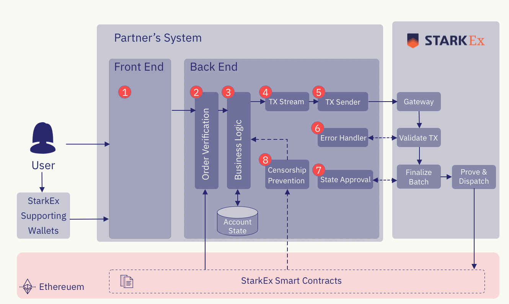

# 77-Bit L2 API [![Github Actions][gha-badge]][gha] [![Dotnet][dotnet-badge]][dotnet]

[gha]: https://github.com/threesigmaxyz/sevensevenbit-l2-contracts/actions
[gha-badge]: https://github.com/threesigmaxyz/sevensevenbit-l2-contracts/actions/workflows/ci.yml/badge.svg
[dotnet]: https://dotnet.microsoft.com/en-us/
[dotnet-badge]: https://img.shields.io/badge/Built%20with-.NET-purple.svg


The 77-Bit L2 API that manages the transactions and both on and off-chain state, in a safe and consistent manner by integrating with the StarkEx engine.

# Architecture
The 77-Bit L2 is a concrete of a ZK based Ethereum L2, powered by StarkEx.
It offers a Layer 2 scalability engine for secure, robust, and non-custodial operations.

1. **Front End:** Executes operations in StarkEx engine, requiring a STARK signature scheme.
2. **Order Verification:** Validates user operations like signatures or balances and waits for on-chain confirmations for actions like deposits.
3. **Business Logic:** Handles transaction flow and updates account states.
4. **Transaction Stream:** Validates and indexes transactions with tx_ids.
5. **Transaction Sender:** Ensures execution upon successful transaction receipt.
6. **Error Handling:** Handles invalid transactions and reports to a dedicated endpoint.
7. **Batch Approval:** Approves batches before on-chain submission.
8. **Censorship Prevention:** Monitors and serves forced operations within a defined time period.

# Getting Started
## Requirements
In order to run the 77-Bit L2 API you must install the following:

- [.NET Core](https://dotnet.microsoft.com/download)
- [Docker](https://www.docker.com/)

Additionaly, you should have [make](https://man7.org/linux/man-pages/man1/make.1.html) installed.

## Installation
```sh
git clone https://github.com/threesigmaxyz/sevensevenbit-l2-api
cd sevensevenbit-l2-api
```

## Running
The following command will start all system components and execute DB migrations:
```sh
make all
```
More granular commands can be found in `.make/docker.mk`.

## Testing
To run all tests execute the following command:
```
make test
```
More granular test commands can be found in `.make/tests.mk`.

# About Us
[Three Sigma](https://threesigma.xyz/) is a venture builder firm focused on blockchain engineering, research, and investment. Our mission is to advance the adoption of blockchain technology and contribute towards the healthy development of the Web3 space.

If you are interested in joining our team, please contact us [here](mailto:info@threesigma.xyz).